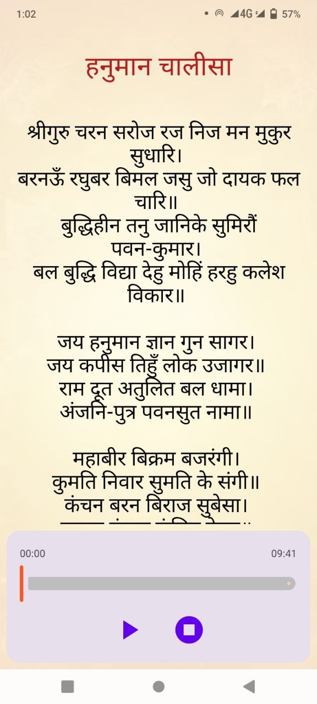
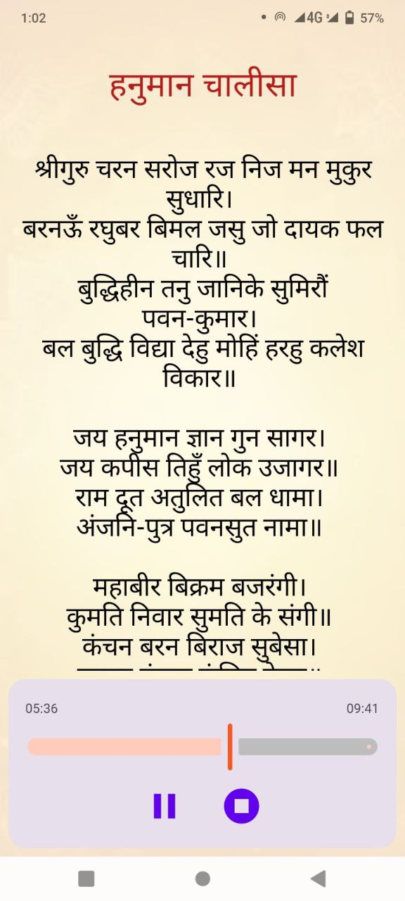
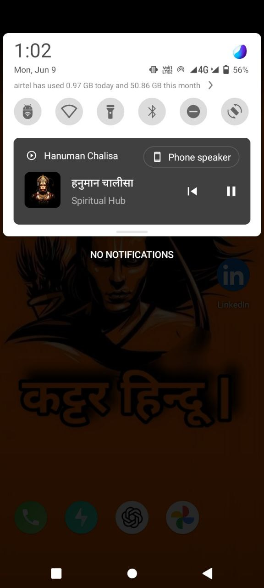

# 🎶 Jetpack Media3 Hanuman Chalisa App

---

### 📱 About the App

This is a simple devotional app built for practicing [**Media3 ExoPlayer**](https://developer.android.com/jetpack/androidx/releases/media3), foreground services, and clean [**Jetpack Compose**](https://developer.android.com/jetpack/compose) UI. It plays the Hanuman Chalisa audio with a modern media notification just like Spotify and loads the text from assets using `ViewModel`. The focus of this app was to understand how music/audio apps are built in production.

> ✅ Available on Play Store: [Hanuman Chalisa](https://play.google.com/store/apps/details?id=com.spiritual.hub)

---

### 👨‍💻 My Role

I built the **entire project myself** — focusing on clean structure and modern development:

- Used [**Jetpack Compose**](https://developer.android.com/jetpack/compose) for all UI
- Implemented [**Media3 ExoPlayer**](https://developer.android.com/jetpack/androidx/releases/media3) with `MediaSessionService`
- Setup **notification playback controls**
- Followed **MVVM architecture**
- Used **Hilt** for dependency injection
- Loaded Hanuman Chalisa from assets at app launch via `ViewModel.init`

---

### 🧰 Tech Stack

| Layer        | Tools & Frameworks                                  |
|--------------|-----------------------------------------------------|
| UI           | Jetpack Compose, Material 3                         |
| Audio        | Media3 ExoPlayer, MediaSessionService               |
| Architecture | MVVM, AndroidViewModel, Hilt                        |
| Assets       | Local `.mp3` & `.txt` for Hanuman Chalisa           |
| Android APIs | SplashScreen, ForegroundService, Notifications      |

---

### ✨ Key Features

- 📖 Display full **Hanuman Chalisa** in Hindi
- 🎵 Seamless **audio playback** with repeat
- 🔔 System-level **media notification**
- 🕹️ Full **play/pause/stop/seek** functionality
- 🌙 Simple & elegant **Compose UI**
- 🔁 Audio loops by default (no internet needed)

---

### 📸 Screenshots

  
  
  
  

---

### 🚀 Project Status

📱 Published to Play Store  
👨‍💼 Ready to showcase in interviews or as reference  
🔒 Code is open but content (audio/text) belongs to respective owners

---

### 📄 License

This repo is for demo and portfolio use.  
All content © Aman Sharma – reuse only with permission.

---

### 🙌 Contact

📧 [officialprofin@gmail.com](mailto:officialprofin@gmail.com)  
🔗 [LinkedIn – engineer-aman-sharma](https://linkedin.com/in/engineer-aman-sharma)

---

### 📚 Related Links

- [Jetpack Compose](https://developer.android.com/jetpack/compose)
- [Media3 ExoPlayer](https://developer.android.com/jetpack/androidx/releases/media3)
- [Hilt Dependency Injection](https://developer.android.com/training/dependency-injection/hilt-android)
